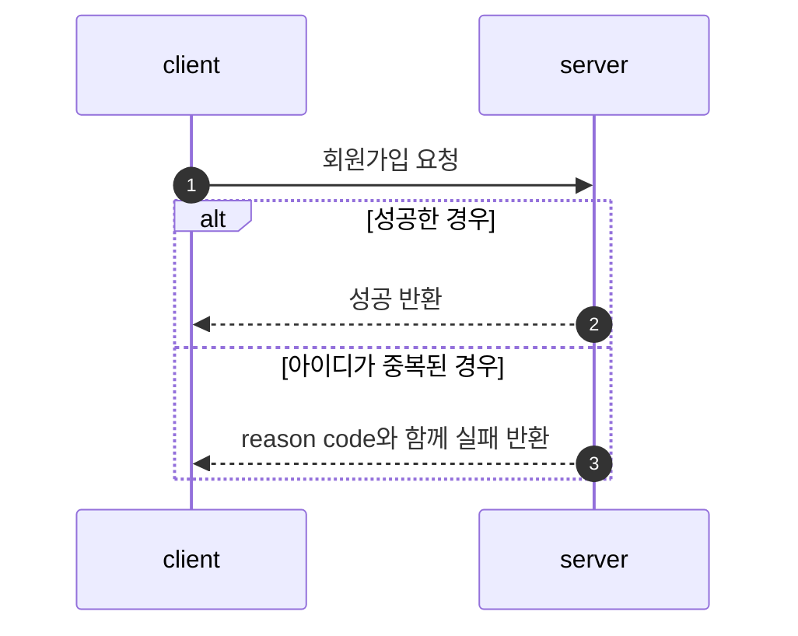
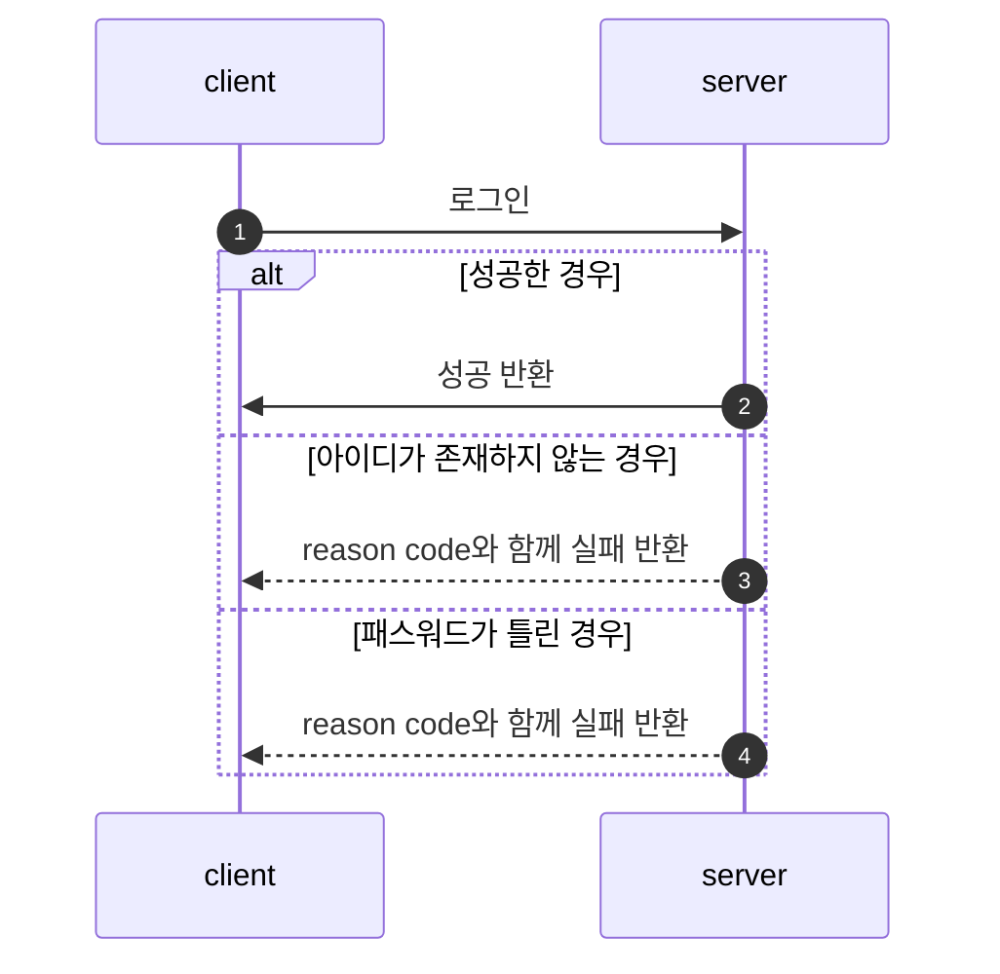
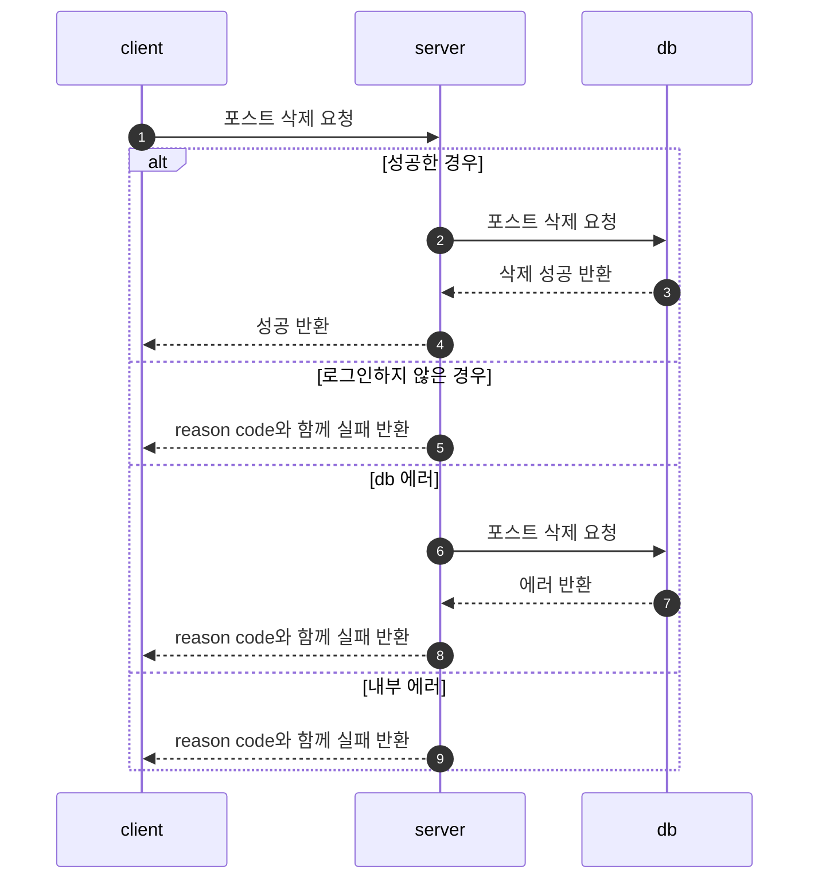
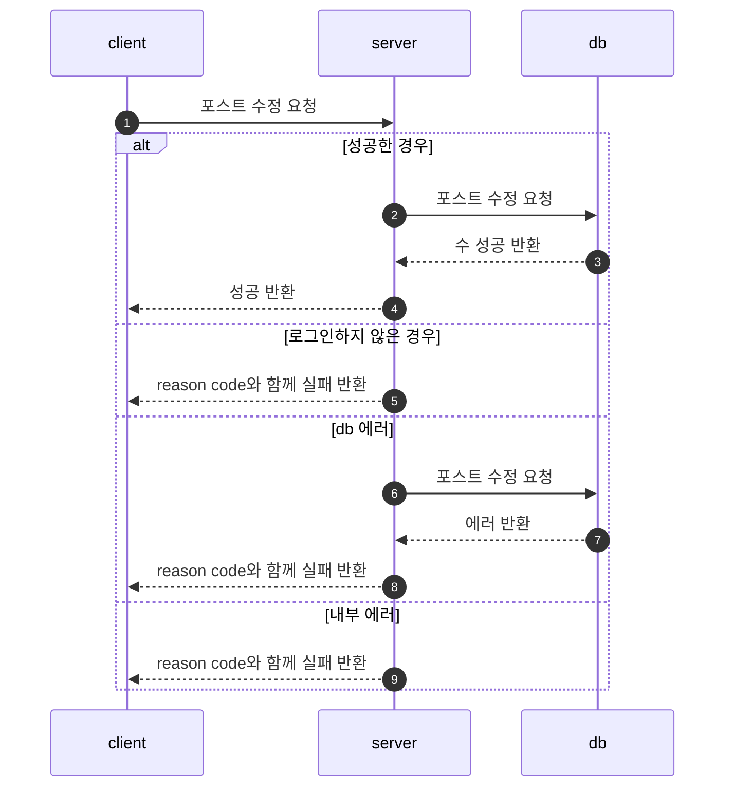
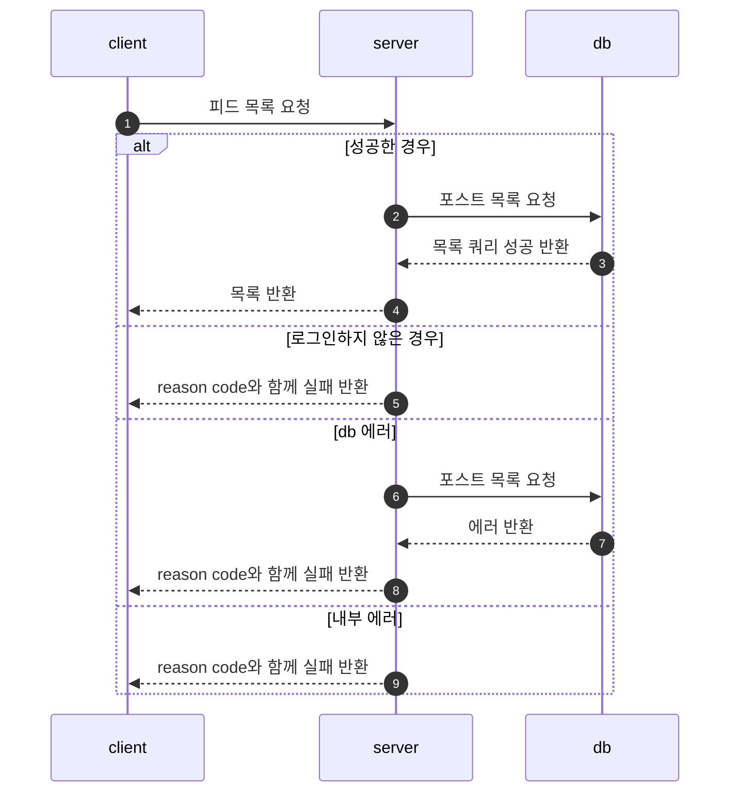
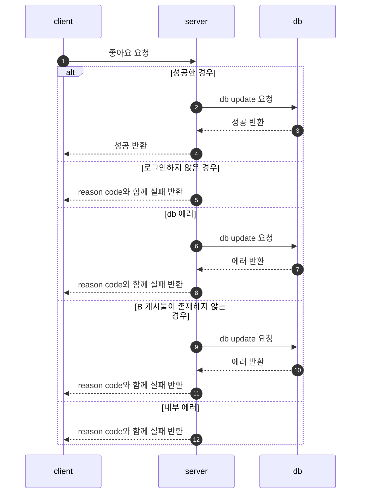
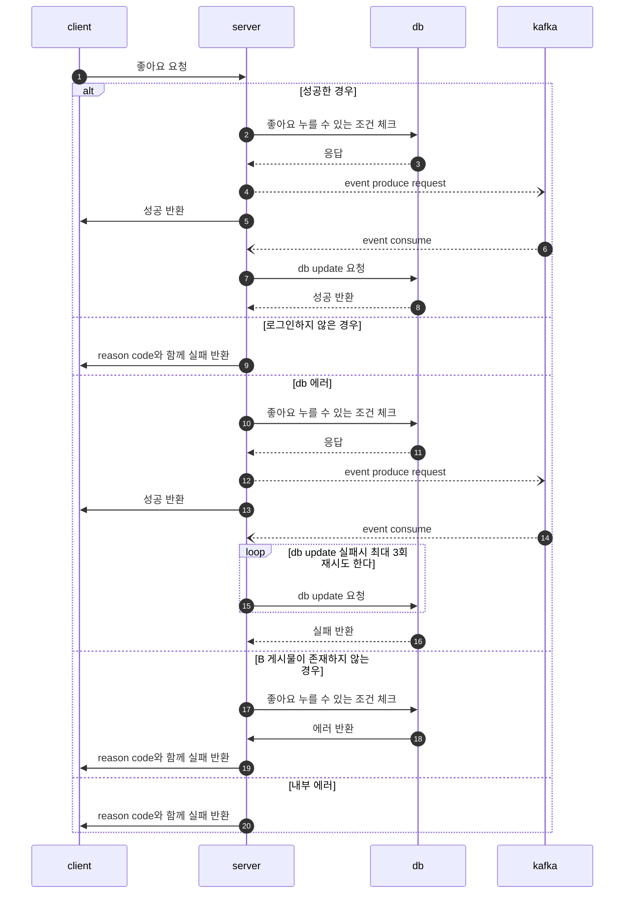
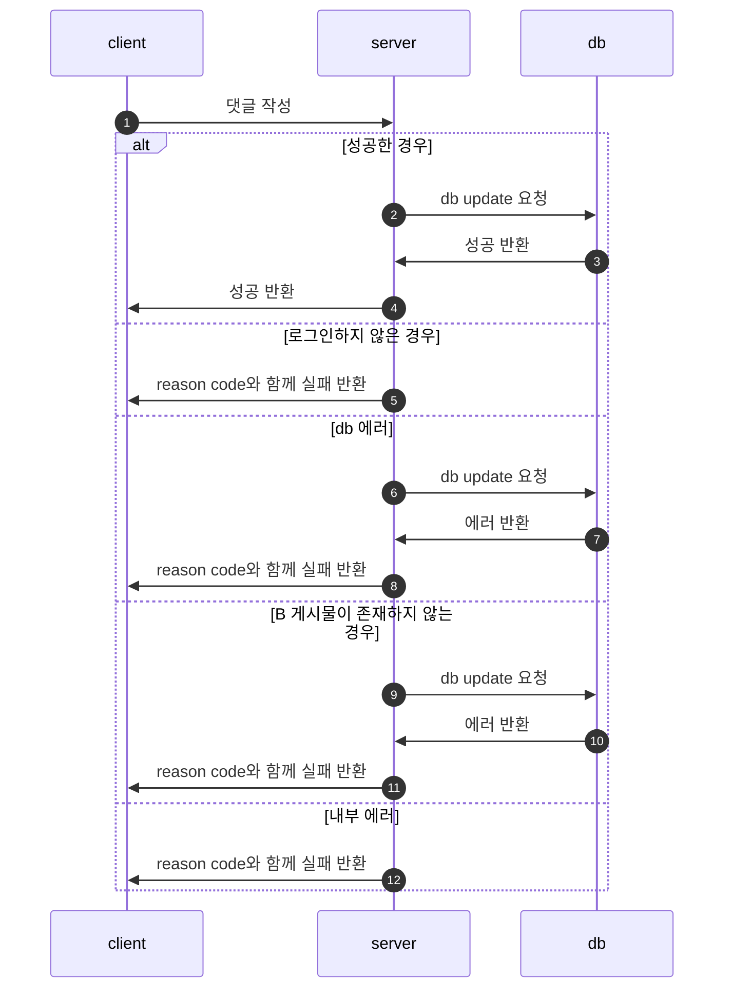
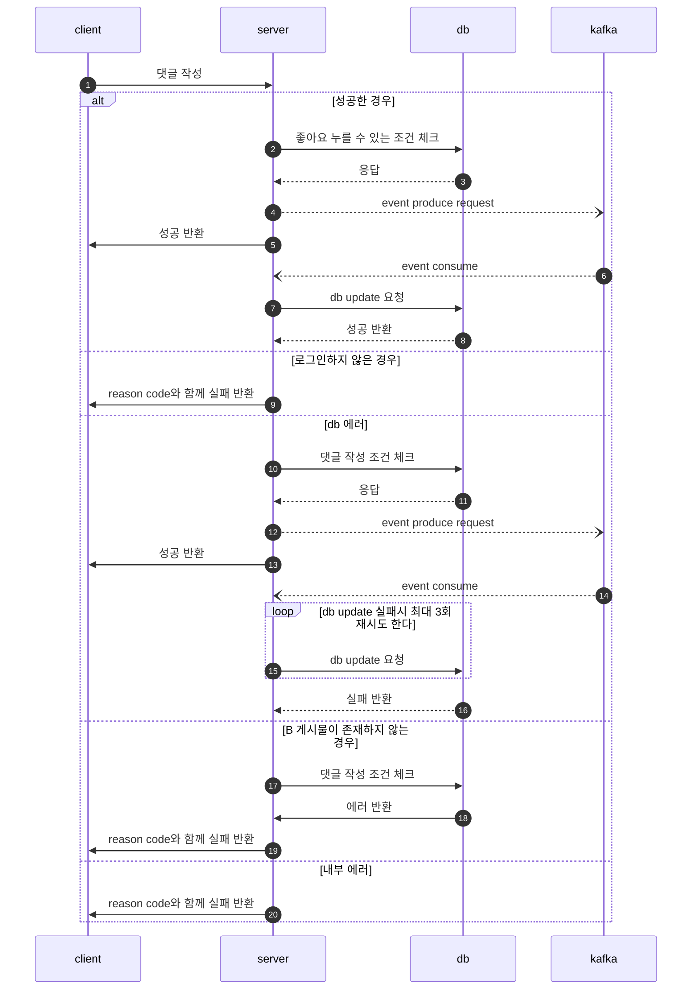
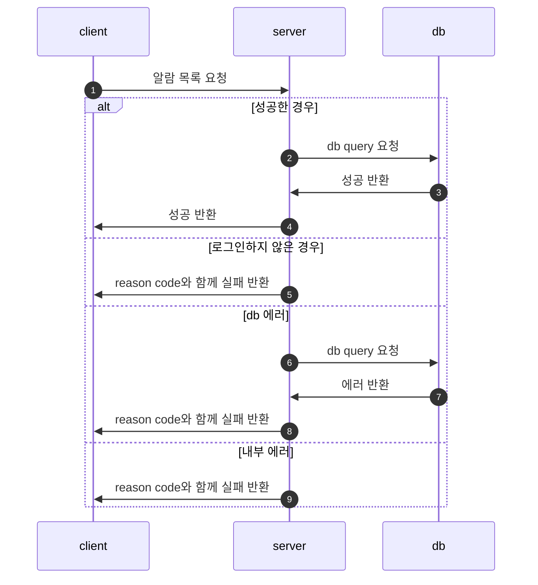

# Simple SNS

## 요구사항 분석
- POST LIST API
  - 모든 user의 글을 모아서 보여주는 API
  - Paging 및 정렬
  - 제목 , 작성자 , 본문을 가져옴
- POST CREATE API
  - 제목과 본문을 이용하여 포스트 작성
- User Sign Up API
  - User name과 password를 이용하여 회원가입
- User Sign In API
  - User name과 password를 이용하여 로그인
- My Post API
  - 로그인한 user의 글을 모아서 보여주는 API
  - Paging 및 정렬
  -  제목, 작성자, 본문을 가져옴
- Post Delete API
  - 포스트를 삭제하는 API
- Post Modify API
  - 제목과 본문을 수정할 수 있는 API
- SSE(Sever-Sent Event) 를 사용하여 실시간 알람 기능

## Tech Stack

- Intellij IDEA Ultimate
- Java 11
- Spring Boot 2.6.7
- Spring Boot Actuator
- Spring Data JPA
- JWT
- postgresql
- hibernate-types
- Spring Security
- Lombok
- CloudKaraka
- react
- Heroku

## Flow Chart

1. 회원가입

2. 로그인

3. 포스트 작성

4. 포스트 삭제

5. 포스트 수정

6. 피드 목록

7. 좋아요 기능 : User A가 B 게시물에 좋아요를 누른 상황

8. 댓글 기능 : User A가 B 게시물에 댓글을 남긴 상황

9. 알람 기능 : User A의 알람 목록에 대한 요청을 한 상황

